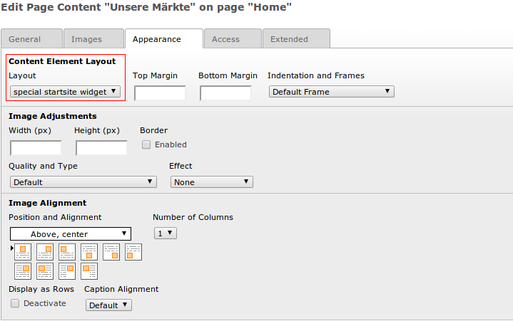

================================
Content und RTE
================================
`Fluid-Template-Manager.de <http://www.fluid-template-manager.de>`_ / `Dokumentation <http://www.fluid-template-manager.de/documentation>`_ / `Content und RTE <http://fluid-template-manager.de/documentation/ContentAndRte.html>`_

----------------------------------------------------------------------------------------------------------------
Content-Layouts 
----------------------------------------------------------------------------------------------------------------
Mit Hilfe der Content-Layouts sind Sie in der Lage, normale Content-Elemente mit Styles zu versehen.
Die Auswahl der Content-Layouts finden Sie in normalen Content-Elementen auf dem Tab *Appearance*

Hier eigene Werte bereitzustellen ist mit dem FTM sehr einfach:

**1.** Erstellen Sie im Verzeichnis ``ftm_theme_website/Resources/Public/Less/LessBasics/ContentLayouts`` eine Datei, die nur die Style-Angaben für Ihr Content-Layout enthält.
Die Datei sollte einen aussagekräftigen Namen tragen. Wobei der Name nur aus Buchstaben und - bestehen darf.
Bspw. ``special-startsite-widget.less``
Für das Label in der späteren Auswahlbox wird der gleiche Name verwendet. Lediglich die - werden durch Leerzeichen ersetzt.

**2.** Fügen Sie die gerade erstellte Less-Datei in Ihre ``ftm_theme_website/Resources/Public/Less/import.less`` ein, damit das Less auch in CSS Kompiliert wird.

**3.** Nun müssen Sie nur noch das TYPOScript neu generieren und Ihr Content-Layout sollte verfügbar sein.

**Was passiert im Hintergrund?**

Über die Less-Datei und das Einbinden in die import.less haben Sie die erforderlichen CSS-Stile bereitgestellt.
Das TYPOScript enthält nun nach dem Neu-generieren die notwendigen Setup und Page-TYPOScript Anweisungen, so dass die Content-Layoutauswahl als CSS-Klasse um das Content-Element gelegt wird.

.. include:: ./Snippets/PoweredBy.rst