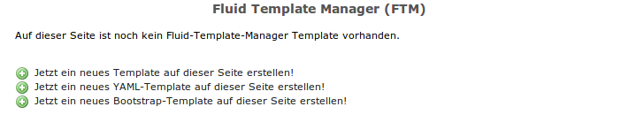
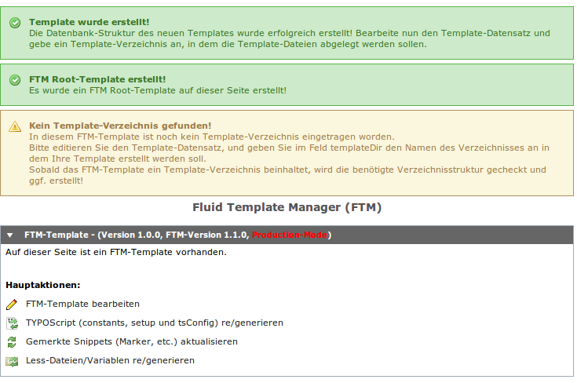
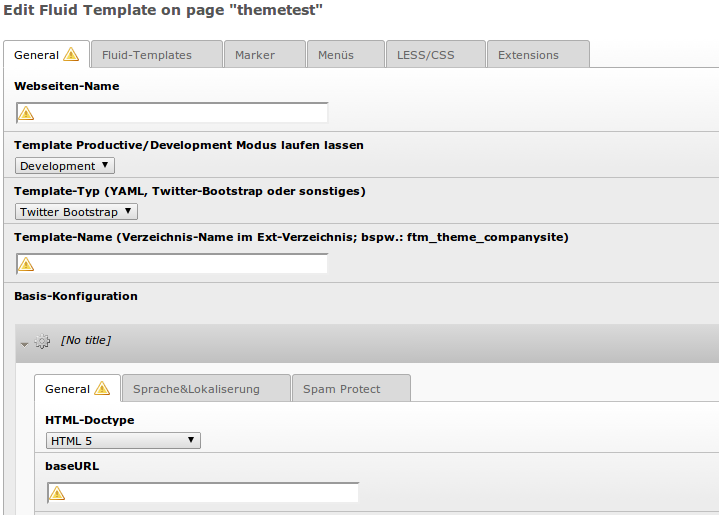
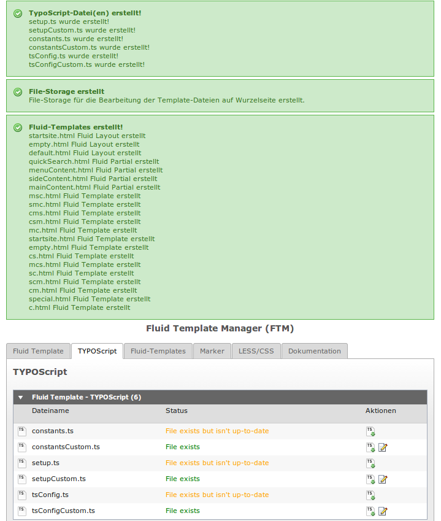
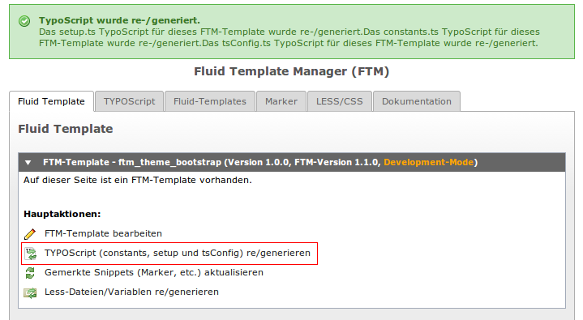

====================================================================
Template erstellen
====================================================================
`Fluid-Template-Manager.de <http://www.fluid-template-manager.de>`_ / `Dokumentation <http://www.fluid-template-manager.de/documentation>`_ / `Template erstellen <http://www.fluid-template-manager.de/documentation/CreateNewTemplate.html>`_

Hier wird beschrieben, wie man ein neues Template erstellen kann.
Hierbei wird unterschieden zwischen einem Template welches YAML, Twitter Bootstrap 3 oder kein CSS-Framework nutzt.

--------------------------------------------------------------------
Bootstrap-Template erstellen
--------------------------------------------------------------------
Um ein neues Bootstrap-Template zu erstellen geht man wie folgt vor:

**1.** Eine neue Top-Level Seite erstellen und diese anwählen.

**2.** Unter *WEB* den *Fluid-Template-Manager* anwählen.

**3.** Dann *Jetzt ein neues Bootstrap-Template auf dieser Seite erstellen!* klicken.

**4.** Nach dem der Template-Datensatz angelegt worden ist, klicken Sie auf *FTM-Template bearbeiten* um die erforderliche Grundkonfiguration vorzunehmen.

**5.** Hier müssen nun die folgenden Pflichtangaben gemacht werden:

* Webseiten-Name, bspw. ``Bootstrap-Seite``
* Template-Name, bspw. ``ftm_theme_bootstrap`` (muss mit ``ftm_theme_`` beginnen!)
* baseURL, bspw. ``http://fluid-template-manager.de/``

.. important:: Machen Sie an dieser Stelle erstmal nur die Pflichtangaben und Speichern&Schließen Sie Ihr Template. Der FTM erstellt im gleichen Zuge weitere vordefinierte Datensätze!

Danach das Template speichern und schließen.

**6** Nach dem Speichern wird die benötigte Template-Struktur erstellt.
Sie finden das Template nun unter dem angegebenen Namen im ``typo3conf/ext`` Verzeichnis.
In unserem Fall im ``typo3conf/ext/ftm_theme_bootstrap`` Verzeichnis.

**8.** Laden Sie sich nun `Bootstrap 3 <http://getbootstrap.com>`_ herunter und legen Sie es im Verzeichnis ``typo3conf/ext/ftm_theme_bootstrap/Resources/Public/Contrib/bootstrap`` ab.

..

**7.** Nun müssen Sie abschließend einmal das Basis-TYPOScript generieren.

.. include:: ./Snippets/PoweredBy.rst