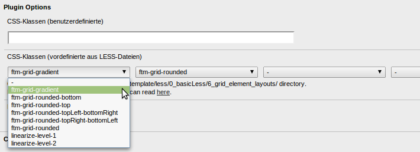

================================
CSS/LESS im FTM
================================
`Fluid-Template-Manager.de <http://www.fluid-template-manager.de>`_ / `Dokumentation <http://www.fluid-template-manager.de/documentation>`_ / `CSS/LESS im FTM <http://fluid-template-manager.de/documentation/Css-Less.html>`_

Lesen Sie hier wie Sie Ihre FTM-Template mit CSS/LESS optimieren und flexibel halten. 

.. important:: Achtung: Diese Seite ist veraltet und wird gerade überarbeitet!

--------------------------------------------------------------------
Allgemeines über CSS/LESS im FTM
--------------------------------------------------------------------
Der FTM verwendet in Sachen CSS den CSS-Compiler `LESS <http://lesscss.org/>`_. Dies erlaubt.. Des Weiteren wird das FTM von Haus aus mit LESS Elements um eine Basis an nützlichen Mixins bereistellen zu können. Abschließend werden alle generierten CSS-Dateien mit Hilfe der ScriptMerger-Extension gemergt.

Grundsätzlich gibt es zum einen das Verzeichnis css: Die direkt in diesem Verzeichnis liegenden Dateien werden dynamisch erstellt. Legen Sie hier keine eigenen Dateien ab, da diese sonst vom LESS-Compiler gelöscht werden. Sollten Sie pures CSS ablegen wollte, wie bspw. YAML, so legen Sie dieses am besten in einem Unterverzeichnis ab.

Des Weiteren gibt es das Verzeichnis less: Hier legen Sie alle LESS-Dateien ab. Sie brauchen keinerlei Dateien mehr in Typo3 direkt einbinden, dies erledigt alles der LESS-Compiler für Sie. Legen Sie hier einfach so viele LESS-Dateien ab wie Sie brauchen. Diese werden automatisch ausgelesen, compiliert und dann mit dem ScriptMerger zu einer Datei zusammengefasst.

LESS-Dateien:

* Legen Sie ruhig für jede Extension eine eigene LESS-Datei an. Bspw. eine ext_ke_search.less für alle CSS-Deklarationen für die ke_search Extension.
* Eine style.less beinhaltet alle Includes 

**Achtung:**
.. include:: ./Snippets/LocalConfigurationAllowedFiles.rst

.. TODO:
    @todo: Teile und Herrsche; beschreiben wie die Parts in einzelne Less-Dateien aufgeteilt werden sollen

~~~~~~~~~~~~~~~~~~~~~~~~~~~~~~~~~~~~
CSS-Klassen und -ID Benennung
~~~~~~~~~~~~~~~~~~~~~~~~~~~~~~~~~~~~
Bei der Benennung CSS-Klassen und IDs empfehlen wir die gleiche schreibweise wie es auch Bootstrap und YAML tun, 
in dem wir Bezeichnerteile immer durch - (Minus) trennen. Somit haben die kompletten Templates eine einheitliche Namensstruktur.

--------------------------------------------------------------------
Less-Variablen
--------------------------------------------------------------------
**Stand:** Dieser Artikel wurde für FTM 1.0.5 geschrieben (2013-05-09)

Der FTM bietet die Möglichkeit LESS-Variablen über die GUI zu definieren. Somit sind Sie in der Lage, verschiedene visuelle Eigenschaften in Ihren Template über diese zu steuern. Das bietet viele Vorteile. Sie können also ein recht allgemeines Template entwickeln und bspw. die Farbwelt komplett über LESS-Variablen steuern. Soll nun eine neue Webseite aufgesetzt werden, kann man das Template importieren und direkt die komplette Farbwelt mit nur wenigen Klicks anpassen.

TODO: Hier ein Bild der Liste

Beachten Sie, das die Reihenfolge der LESS-Variablen u.U. wichtig ist (bspw. wenn Sie Variablen verschachteln). Sie können die Reihenfolge der LESS-Variablen im Template-Datensatz auf dem Tab LESS-Variablen per Drag and Drop verändern.

**Achtung:** Die neue Reihenfolge ist aktiv, wenn Sie das LESS neu generiert haben. 

~~~~~~~~~~~~~~~~~~~~~~~~~~~~~~~~~~~~~~~~~~~~~~~~~~~~~~~~~~~~~~~~~~~~
LESS-Variablen Typen
~~~~~~~~~~~~~~~~~~~~~~~~~~~~~~~~~~~~~~~~~~~~~~~~~~~~~~~~~~~~~~~~~~~~
Im FTM können für LESS-Variablen die folgenden Typen vergeben werden:

**String:** Strings sind Text-Variablen, deren Inhalt später im generierten LESS in Hochkomma dargestellt werden.
**Wert:** Werte sind Variablen, deren Inhalt später im generierten LESS ohne Hochkomma dargestellt werden. Dies könnten bspw. Angaben wie 2px oder 50% sein.
**Color:** Color sind Farb-Variablen, die als Hex-Wert angegeben werden müssen. Für die Auswahl kann auch der integrierte Color-Picker verwendet werden. 

~~~~~~~~~~~~~~~~~~~~~~~~~~~~~~~~~~~~~~~~~~~~~~~~~~~~~~~~~~~~~~~~~~~~
Vordefinierte LESS-Variablen
~~~~~~~~~~~~~~~~~~~~~~~~~~~~~~~~~~~~~~~~~~~~~~~~~~~~~~~~~~~~~~~~~~~~
Der FTM erstellt einige häufig verwendete Variablen automatisiert. Diese erkennt man in der Variablen-Übersichtsliste daran, das diese nicht bearbeitet werden können. Die aktuell automatisiert erstellten Variablen lauten:

* @baseUrl: Enthält die Base-URL als String, bspw. http://fluid-template-manager.de/
* @baseUrlTemplate: Enthält den Pfad zum Template als String, bspw. http://fluid-template-manager.de/fileadmin/tyaml/template/
* @fileadminDir: Enthält den fileadmin-Verzeichnisnamen als String, bspw. tyaml 

Diese vordefinierten LESS-Variablen können auch verschachtelt in neuen LESS-Variablen verwendet werden. Eine LESS-Variable für einen Bildpfad (@baseUrlImage) könnte dann wie folgt aussehen: 

.. code-block:: php

    @{baseUrlTemplate}img/

~~~~~~~~~~~~~~~~~~~~~~~~~~~~~~~~~~~~~~~~~~~~~~~~~~~~~~~~~~~~~~~~~~~~
LESS-Variablen erstellen
~~~~~~~~~~~~~~~~~~~~~~~~~~~~~~~~~~~~~~~~~~~~~~~~~~~~~~~~~~~~~~~~~~~~
TODO:

**Achtung:** Die neu erstellte LESS-Variable ist erst verfügbar, wenn Sie das LESS neu generiert haben. 

~~~~~~~~~~~~~~~~~~~~~~~~~~~~~~~~~~~~~~~~~~~~~~~~~~~~~~~~~~~~~~~~~~~~
LESS-Variablen löschen
~~~~~~~~~~~~~~~~~~~~~~~~~~~~~~~~~~~~~~~~~~~~~~~~~~~~~~~~~~~~~~~~~~~~
TODO:

**Achtung:** Die gelöschte LESS-Variable ist erst wirklich nicht mehr vorhanden, wenn Sie das LESS neu generiert haben. 

--------------------------------------------------------------------
Vordefinierte CSS/Less-Variablen
--------------------------------------------------------------------
Wenn Sie ein Template vom Typ Bootstrap erstellen, werden alle Bootstrap 3 Variablen automatisiert mit erstellt!
Mehr Informationen über diese Variablen erhalten Sie hier: `http://getbootstrap.com/customize/#less-variables <http://getbootstrap.com/customize/#less-variables>`_.

--------------------------------------------------------------------
Vordefinierte CSS/Less-Klassen für die Grid-Elemente
--------------------------------------------------------------------
**Stand:** Dieser Artikel wurde für FTM 1.0.5 geschrieben (2013-05-09)

Im FTM wurden die Grid-Elemente erweitert, so dass in ihnen vordefinierte CSS/LESS-Klassen ausgewählt werden können. 

Wie Sie im vorherigen Screenshot sehen können wurden von diesen Auswahl-Boxen gleich vier integriert. Dies bietet Ihnen die Möglichkeit verschiedene Style-Klassen miteinander zu vermischen. So könnte bspw. in der ersten Auswahl ein Farbverlauf ausgewählt werden, und in der zweiten Auswahl abgerundete Ecken.

**TODO:** Hier auch nochmal auf linearize-Klassen eingehen und wie man diese für Responsive Designs verwendet

In den Auswahl-Boxen finden Sie einige wenige vordefinierte CSS/LESS-Klassen. Sie können sich aber auch eigene für Ihr Template definieren, so dass der Redakteur Ihrer Seite immer in der Lage ist alle Content-Elemente einheitlich zu gestalten. Verwaltet werden diese CSS/LESS-Klassen eines FTM-Templates über das folgende Verzeichnis: 

.. code-block:: php

    fileadmin/*ihr-template-verzeichnis*/template/less/0_basicLess/6_grid_element_layouts/

In diesem Verzeichnis können nun beliebig viele LESS-Dateien angelegt werden, die jeweils nur den CSS/LESS-Code für die jeweilige Klasse enthält, bspw.: 

.. code-block:: css

    .ftm-grid-gradient {
      .gradient-full();
      
      .ym-gl:first-child .ym-gbox-left {
        padding-left: 1em;
      }
      
      .ym-gr .ym-gbox-right {
        padding-right: 1em;
      }
      
    }

Wichtig hierbei ist, das der Dateiname genauso heißt wie die CSS/LESS-Klasse. In unserem Beispiel muss die Datei also **ftm-grid-gradient.less** heißen.

Natürlich können Sie die schon vorhandenen CSS/LESS-Klassen auch entfernen, damit Ihr Redakteur auch wirklich nur die Styles verwendet, die auf Ihre Seite zugeschnitten sind. Löschen Sie dazu einfach die gleichnamige Datei aus dem Verzeichnis.

Die Realisierung der CSS/LESS-Klassen auf Basis von einzelnen Dateien in Ihrem Template, gibt Ihnen die Möglichkeit diese schnell aus einen vorhandenen Template zu entnehmen und in einem neuen Template wieder einzufügen. Da alle LESS-Dateien später zu einer CSS-Datei zusammen generiert wird, dürfen Sie nicht vergessen nach jeder Änderung in diesen Dateien einmal den FTM-Cache leeren. 

.. include:: ./Snippets/PoweredBy.rst