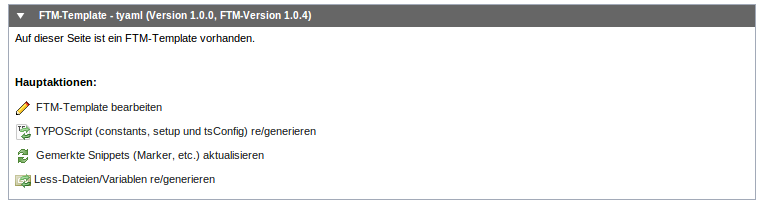
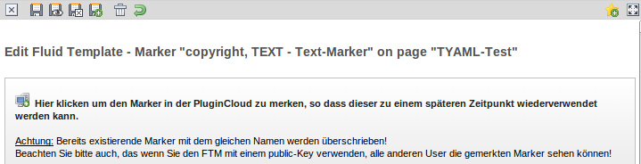
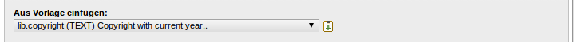

================================
Fluid-Marker
================================
Hier erfährt man alles über die Erstellung und Verwendung von Marker, und wie man diese am besten wiederverwendet. 

--------------------------------------------------------------------
Fluid-Marker
--------------------------------------------------------------------
Im FTM ist es möglich über die GUI Datensätze für TypoScript-Marker zu erstellen. Dies bietet uns viele Möglichkeiten - von der leichteren Wiederverwendbarkeit ganz abgesehen.

So könnte man später bspw. prüfen, welche Marker definiert wurde und diese abgleichen mit den verwendeten Markern im Fluid-Template. 
Sollte es Abweichungen geben, so könnte man eine Meldung ausgeben und den Template-Entwickler darauf hinweisen.

Im Allgemeinen haben die Marker im FTM-Template folgende Struktur: 

1. ``lib.area`` - Hier liegen alle Content-Äreas, wie bspw.:

* lib.area.mainContent
* lib.area.menuContent
* lib.area.sideContent
* lib.area.teaser
* lib.area.extended

2. lib.nav - Hier liegen alle Navigationen, wie bspw.:

* lib.nav.language
* lib.nav.footer
* lib.nav.main
* lib.nav.sub

3. ..und diverse selbstdefinierte bzw. Template abhängige, wie bspw.:

* lib.logo
* lib.copyright
* lib.searchBox

----
also all

Die Marker findet man im Template-Datensatz unter dem Tab *Marker*. 

~~~~~~~~~~~~~~~~~~~~~~~~~~~~~~~~~~~~~~~~~~~~~~~~~~~~~~~~~~~~~~~~~~~~
Marker-Name
~~~~~~~~~~~~~~~~~~~~~~~~~~~~~~~~~~~~~~~~~~~~~~~~~~~~~~~~~~~~~~~~~~~~
Hier wird der Name des Markers eingetragen. Dieser sollte nur aus Buchstaben bestehen (lower-camel-case). 
Wird hier der Name copyright eingegeben, wird im generierten TypoScript der Marker lib.copyright erstellt.

**Achtung:** Jeder Marker-Name darf nur einmal existieren, da er sich sonst selbst überschreibt! 

~~~~~~~~~~~~~~~~~~~~~~~~~~~~~~~~~~~~~~~~~~~~~~~~~~~~~~~~~~~~~~~~~~~~
Marker-Typ
~~~~~~~~~~~~~~~~~~~~~~~~~~~~~~~~~~~~~~~~~~~~~~~~~~~~~~~~~~~~~~~~~~~~
Gibt des Typ des Markers an (siehe TYPOScript-Reference). 

~~~~~~~~~~~~~~~~~~~~~~~~~~~~~~~~~~~~~~~~~~~~~~~~~~~~~~~~~~~~~~~~~~~~
Marker-Beschreibung
~~~~~~~~~~~~~~~~~~~~~~~~~~~~~~~~~~~~~~~~~~~~~~~~~~~~~~~~~~~~~~~~~~~~
Hier kann eine interne Beschreibung/Information hinterlegt werden, bspw. ein kurzer Text was der Marker beinhaltet.

~~~~~~~~~~~~~~~~~~~~~~~~~~~~~~~~~~~~~~~~~~~~~~~~~~~~~~~~~~~~~~~~~~~~
Marker-TypoScript
~~~~~~~~~~~~~~~~~~~~~~~~~~~~~~~~~~~~~~~~~~~~~~~~~~~~~~~~~~~~~~~~~~~~
Hier wird das TypoScript für den Marker eingegeben. Hierbei ist zu beachten das man in der TypoScript-Hierachie oberhalb von lib.copyright arbeitet.

**Achtung:** Es wird empfohlen TypoScript im TypoScript-Editor zu bearbeiten, da man hier HTML-Entities verwenden kann, ohne das diese nach dem neu-laden ersetzt werden. 

--------------------------------------------------------------------
Fluid-Marker Beispiele
--------------------------------------------------------------------

~~~~~~~~~~~~~~~~~~~~~~~~~~~~~~~~~~~~~~~~~~~~~~~~~~~~~~~~~~~~~~~~~~~~
Copyright-Marker
~~~~~~~~~~~~~~~~~~~~~~~~~~~~~~~~~~~~~~~~~~~~~~~~~~~~~~~~~~~~~~~~~~~~
Als Name wird hier *copyright* verwendet, als Typ *TEXT* und im TypoScript:

.. code-block:: ts

    data = date:U
    strftime = %Y
    wrap = < div id="copyright">& copy;& nbsp; | & nbsp;Fluid-Template-Manager - All rights reserved.< /div>

Ergibt folgendes generiertes TypoScript:

.. code-block:: ts

    lib.copyright = TEXT
    lib.copyright.data = date:U
    lib.copyright.strftime = %Y
    lib.copyright.wrap = < div id="copyright">& copy;& nbsp; | & nbsp;Fluid-Template-Manager - All rights reserved.< /div>

Wird wie folgt im Template verwendet:

.. code-block:: css

    Als Tag:
    < f:cObject typoscriptObjectPath="lib.copyright">< /f:cObject>
    Inline:
    {f:cObject(typoscriptObjectPath: 'lib.copyright')}

~~~~~~~~~~~~~~~~~~~~~~~~~~~~~~~~~~~~~~~~~~~~~~~~~~~~~~~~~~~~~~~~~~~~
Template-Path-Marker
~~~~~~~~~~~~~~~~~~~~~~~~~~~~~~~~~~~~~~~~~~~~~~~~~~~~~~~~~~~~~~~~~~~~
Als Name wird hier *ftmTemplateUrl* verwendet, als Typ *TEXT* und im TypoScript:

.. code-block:: ts

    value = {$ftmTemplateUrl}

Ergibt folgendes generiertes TypoScript:

.. code-block:: ts

    lib.ftmTemplateUrl = TEXT
    lib.ftmTemplateUrl.value = {$ftmTemplateUrl}

Wird wie folgt im Template verwendet:

.. code-block:: ts

    Als Tag:
    < f:cObject typoscriptObjectPath="lib.ftmTemplateUrl">< /f:cObject>
    Inline:
    {f:cObject(typoscriptObjectPath: 'lib.ftmTemplateUrl')}

--------------------------------------------------------------------
Fluid-Marker serverübergreifend austauschen
--------------------------------------------------------------------
Mit dem FTM (ab Version 1.0.4) sind Sie in der Lage sich Marker über einen Button zu merken. 
Dieses geschieht in der PluginCloud, damit ein serverübergreifendes Austauschen von Markern möglich wird. (Eine ähnliche Funktion ist auch für weitere Bereiches des FTM, wie bspw. Templates, Partials, etc., in Planung)

Gemerkt werden diese Marker in einem Repository, das an den PluginCloud-Key gebunden ist. 
In der aktuellen Version läuft das Austauschen von Markern noch über den public-Key, d.h. alle User können alle gemerkten Marker sehen (achten Sie daher darauf welche Daten Sie im Marker sharen).

Der nächste Schritt in der Entwicklung unserer Marker-Repositories ist, private PluginCloud-Keys bereitzustellen. 
D.H. man gibt in der FTM-Extension Konfiguration seinen privaten-Key an, darauf hin kann die PluginCloud nun Ihre gespeicherten Marker nur für Sie verwalten.

Das ist vor allem für Agenturen interessant. Werden alle TYPO3-Auftritte mit dem FTM und dem Agentur PluginCloud-Key ausgestattet, sind alle Entwickler in der Lage (egal in welcher TYPO3-Instanz Sie sich gerade befinden) oft gebrauchte Marker zu merken, wiederherzustellen und immer wieder zu verbessern. Haben Sie Interesse unser neues Feature der privaten Marker-Repositories zu testen und damit Ihren Workflow zu optimieren, dann schreiben Sie uns an info@fluid-template-manager.de. 

~~~~~~~~~~~~~~~~~~~~~~~~~~~~~~~~~~~~~~~~~~~~~~~~~~~~~~~~~~~~~~~~~~~~
Marker synchronisieren
~~~~~~~~~~~~~~~~~~~~~~~~~~~~~~~~~~~~~~~~~~~~~~~~~~~~~~~~~~~~~~~~~~~~
Bevor die bereits gemerkten Marker in einer neuen TYPO3-Instanz verwendet werden können, müssen diese von der PluginCloud abgerufen (sprich synchronisiert) werden. 
Dies können Sie aus der Übersicht des FTMs heraus machen, einfach auf 'Gemerkte Snippets aktualisieren' klicken: 

~~~~~~~~~~~~~~~~~~~~~~~~~~~~~~~~~~~~~~~~~~~~~~~~~~~~~~~~~~~~~~~~~~~~
Marker merken
~~~~~~~~~~~~~~~~~~~~~~~~~~~~~~~~~~~~~~~~~~~~~~~~~~~~~~~~~~~~~~~~~~~~
Um einen Marker zu merken, muss dieser geöffnet werden. 
Im Marker-Datensätz finden Sie dann im oberen Bereich eine Zeile zur Synchronisation. 
Klicken Sie hier einfach auf *Marker in der PluginCloud merken*: 

**Aber Achtung:** Speichern Sie keine sensiblen Daten im Marker-Repository. 
Sofern Sie einen public-Key verwenden, können alle anderen User diese 'öffentlichen' Marker sehen. 

~~~~~~~~~~~~~~~~~~~~~~~~~~~~~~~~~~~~~~~~~~~~~~~~~~~~~~~~~~~~~~~~~~~~
Marker aus Vorlage verwenden
~~~~~~~~~~~~~~~~~~~~~~~~~~~~~~~~~~~~~~~~~~~~~~~~~~~~~~~~~~~~~~~~~~~~
Um einen gemerkten Marker in einen bereits existierenden Datensatz einzufügen, muss der gewünscht Marker einfach ausgewählt werden und durch einen Klick auf das gewohnte 'Einfügen' Symbol eingefügt werden. 

Dabei wird der geöffnete Datensatz nun mit den neuen Daten befüllt und geschlossen. 

.. include:: ./Snippets/PoweredBy.rst

