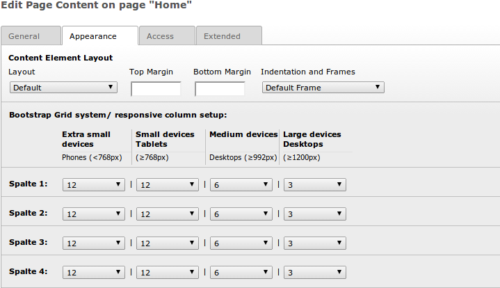

================================
Grid-Layouts
================================
`Fluid-Template-Manager.de <http://www.fluid-template-manager.de>`_ / `Dokumentation <http://www.fluid-template-manager.de/documentation>`_ / `Grid-Layouts <http://fluid-template-manager.de/documentation/GridLayouts.html>`_

Die Extension Grid-Elements stellt strukturierende Content-Elemente bereit, die mit Hilfe eines Grid-Layouts dargestellt werden können.
Im folgenden finden Sie alle Informationen über die vom FTM bereitgestellten Grid-Layouts und deren Funktion.

--------------------------------------------------------------------
Allgemein
--------------------------------------------------------------------
Je nach dem welchen Template-Typ (Bootstrap oder YAML) ein FTM-Template hat, werden automatisiert Grid-Layouts angelegt.
Das Anlegen geschieht via TYPOScript und würde entsprechend bereits bestehende Grid-Layout Datensätze mit der gleichen uid überschreiben.

--------------------------------------------------------------------
Bootstrap Grid-Layouts
--------------------------------------------------------------------
Hier eine Liste der automatisch angelegten Bootstrap 3 Grid-Layouts.
Diese Layouts wurde so erweitert, das diese für responsive Sites konfiguriert werden können.

==== ====================== =========== ================================================
uid  Name                   colPos      Beschreibung
==== ====================== =========== ================================================
2001 GridLayout Spalten 1   11          Dieses GridLayout hat 1 Spalte.
2002 GridLayout Spalten 2   11-12       Dieses Grid-Layout kann bis zu 2 Spalten haben.
2003 GridLayout Spalten 3   11-13       Dieses Grid-Layout kann bis zu 3 Spalten haben.
2004 GridLayout Spalten 4   11-14       Dieses Grid-Layout kann bis zu 4 Spalten haben.
2005 GridLayout Spalten 5   11-15       Dieses Grid-Layout kann bis zu 5 Spalten haben.
2006 GridLayout Spalten 6   11-16       Dieses Grid-Layout kann bis zu 6 Spalten haben.
2007 GridLayout Spalten 7   11-17       Dieses Grid-Layout kann bis zu 7 Spalten haben.
2008 GridLayout Spalten 8   11-18       Dieses Grid-Layout kann bis zu 8 Spalten haben.
2009 GridLayout Spalten 9   11-19       Dieses Grid-Layout kann bis zu 9 Spalten haben.
2010 GridLayout Spalten 10  11-20       Dieses Grid-Layout kann bis zu 10 Spalten haben.
2011 GridLayout Spalten 11  11-21       Dieses Grid-Layout kann bis zu 11 Spalten haben.
2012 GridLayout Spalten 12  11-22       Dieses Grid-Layout kann bis zu 12 Spalten haben.
==== ====================== =========== ================================================

Der uid-Bereich für die Bootstrap Grid-Layouts liegt zwischen 2000-2999.
Eigene Bootstrap Grid-Layouts sollten zwischen 2500-2999.
Achten Sie am besten selbst auch darauf, das Sie in Ihren Themes nie zweimal die gleiche uid verwenden.

~~~~~~~~~~~~~~~~~~~~~~~~~~~~~~~~~~~~~~~~~~~~~~~~~~~~~~~~~~~~~~~~~~~~
Grid-Elements Erweiterung
~~~~~~~~~~~~~~~~~~~~~~~~~~~~~~~~~~~~~~~~~~~~~~~~~~~~~~~~~~~~~~~~~~~~
Die Grid-Elements wurden mit Hilfe einer Flex-Form und TCA-Erweiterungen mit Funktionen erweitert.

So finden Sie in einem Grid-Element auf dem Tab General die vordefinierten Grid-Layouts.
Jedes dieser Grid-Layouts wurde auch mit einem Icon versehen, so dass Sie dieses schneller finden und anwählen können.

Des Weiteren wurden die folgenden Felder hinzugefügt:

============================================ =====================================================================================================================================================
Feld                                         Beschreibung
============================================ =====================================================================================================================================================
CSS-Klassen (benutzerdefiniert)              Hier haben Sie die Möglichkeit, den Grid-Layout-Wrapper mit eigenen, benutzerdefnierten CSS-Klassen zu versehen.
CSS-Klassen (vordefinierte aus LESS-Dateien) Hier können Sie Ihre vordefinierten CSS-Klassen auswählen, die Sie über spezielle LESS-Dateien erstellen können.
                                             So haben Sie bspw. die Möglichkeit, auf das Webdesign abgestimmte Rahmen oder Boxen auswählbar zu machen. 
                                             Mit dieser Funktion können dann auch weniger erfahrene Redakteure, speziellere Inhalte leicht anlegen.
                                             Durch das Vierfache vorhanden sein der Auswahlen, haben Sie auch die Möglichkeit verschiedene Eigenschaften zu kombinieren.
                                             So könnte eine Auswahl das GridLayout mit einem Farbton versehen und eine weitere könnte abgerundete Ecken hinzufügen.
                                             Wie Sie solche CSS-Klassen für die Auswahl-Boxen anlegen können, lesen Sie im Abschnitt CSS/LESS in dieser Dokumentation: `http://fluid-template-manager.de/documentation/Css-Less.html#vordefinierte-css-less-klassen-fur-die-grid-elemente <http://fluid-template-manager.de/documentation/Css-Less.html#vordefinierte-css-less-klassen-fur-die-grid-elemente>`.
Anker-Name                                   In diesem Feld können Sie Ihr GridLayout mit einem selbst definierten Anker-Namen versehen.
                                             Somit haben Sie die Möglichkeit, wenn Sie bspw. eine längere Seite mit Scroll-Navigation haben, bestimmte Bereiche über den Anker-Namen anzuscrollen.
============================================ =====================================================================================================================================================

Den Tab Appearance haben wir im GridLayout so erweitert, dass Sie die Möglichkeit haben die Spalten zu konfigurieren.
Wie dieses funktioniert wollen wir anhand eines Beispiels durch gehen.
Ausgangsbasis dafür sollte ein GridLayout der uid 2004 mit 4 möglichen Spalten sein.
Die nächste Abbildung zeigt ein solches GridLayout auf dem Tab Appearance.

Ab der zweiten Zeile beginnt die Bootstrap-Erweiterung. Diese Zeile enthält lediglich Informationen und die Spalten-Header.
Ab der dritten Zeile, beginnen die Einstellungen für die Spalten des GridLayouts.

Da wir ein GridLayout mit 4 Spalten ausgewählen haben, sind in diesem Abschnitt 4 *Spalten*-Zeilen vorhanden.
Hätten wir ein GridLayout mit 6 Spalten auf dem Tab *General* im Feld Grid Layout ausgewählt, hätten wir hier 6 *Spalten*-Zeilen, usw..

Man muss sich nun diese Ansicht als ein Raster vorstellen. 
In den horizontalen Zeilen haben wir die GridLayout-Spalten und in den vertikalen Spalten haben wir die Konfiguration der GridLayout-Spalte für die responsive Darstellung.

Die im vorherigen Bild dargestellte Spalten-Konfiguration würde sich nun wie folgt in einem responsiven Layout verhalten:

**1.** Wenn die Website in einer Auflösung von **≥1200px (Large devices Desktops)** dargestellt wird, so wird das GridLayout in 4 Spalten in einer Zeile dargestellt.
Jede Spalte nimmt dabei 3 Felder vom 12er-Grid ein.

**2.** Wenn die Website in einer Auflösung von **≥992px (Medium devices Desktops)** dargestellt wird, so wird das GridLayout in 2 Spalten in zwei Zeilen dargestellt.
Jede Spalte nimmt dabei 6 Felder vom 12er-Grid ein. Sie könnten die Felder aber auch ungerade verteilen, bspw. 4 Felder für die erste Spalte, 8 Felder für die zweite.

**3.** Wenn die Website in einer Auflösung von **≥786px (Small devices Tablets)** dargestellt wird, so wird das GridLayout in einer Spalte in vier Zeilen dargestellt.
Jede Spalte nimmt dabei 12 Felder von 12er-Grid ein.

**4.** Wenn die Website in einer Auflösung von **<786px (Extra small devices Phones)** dargestellt wird, so wird das genaus wie in Punkt 4. dargestellt.

Mit dieser Matrix an Einstellungen können Sie Ihr GridLayout optimal für die verschiedenen responsiv Stufen konfigurieren.

--------------------------------------------------------------------
YAML Grid-Layouts
--------------------------------------------------------------------
Hier eine Liste der automatisch angelegten YAML Grid-Layouts:

==== ========================== =================== ==============
uid  Name                       colPos              columns
3000 GridLayout 100             10                  12
3001 GridLayout 80-20           11, 15              10, 2
3002 GridLayout 75-25           11, 15              9, 3
3003 GridLayout 66-33           11, 15              8, 4
3004 GridLayout 62-38           11, 15              6, 6
3005 GridLayout 60-40           11, 15              4, 8
3006 GridLayout 50-50           11, 15              6, 6
3007 GridLayout 40-60           11, 15              2, 10
3008 GridLayout 38-62           11, 15              4, 8
3009 GridLayout 33-66           11, 15              4, 8
3010 GridLayout 25-75           11, 15              3, 9
3011 GridLayout 20-80           11, 15              2, 10
3012 GridLayout 60-20-20        11, 13, 15          4, 4, 4
3013 GridLayout 50-25-25        11, 13, 15          4, 4, 4
3014 GridLayout 40-40-20        11, 13, 15          4, 4, 4
3015 GridLayout 40-20-40        11, 13, 15          4, 4, 4
3016 GridLayout 33-33-33        11, 13, 15          4, 4, 4
3017 GridLayout 25-50-25        11, 13, 15          3, 6, 3
3018 GridLayout 25-25-50        11, 13, 15          3, 3, 6
3019 GridLayout 20-60-20        11, 13, 15          3, 6, 3
3020 GridLayout 20-40-40        11, 13, 15          3, 3, 6
3021 GridLayout 20-20-60        11, 13, 15          3, 3, 6
3022 GridLayout 40-20-20-20     11, 12, 14, 15      6, 2, 2, 2
3023 GridLayout 25-25-25-25     11, 12, 14, 15      3, 3, 3, 3
3024 GridLayout 20-40-20-20     11, 12, 14, 15      2, 6, 2, 2
3025 GridLayout 20-20-40-20     11, 12, 14, 15      2, 2, 6, 2
3026 GridLayout 20-20-20-40     11, 12, 14, 15      2, 2, 2, 6
3027 GridLayout 20-20-20-20-20  11, 12, 13, 14, 15  2, 2, 2, 2, 2
==== ========================== =================== ==============

Der uid-Bereich für die YAML Grid-Layouts liegt zwischen 3000-3999.
Eigene YAML Grid-Layouts sollten zwischen 3500-3999.
Achten Sie am besten selbst auch darauf, das Sie in Ihren Themes nie zweimal die gleiche uid verwenden.

.. include:: ./Snippets/PoweredBy.rst

