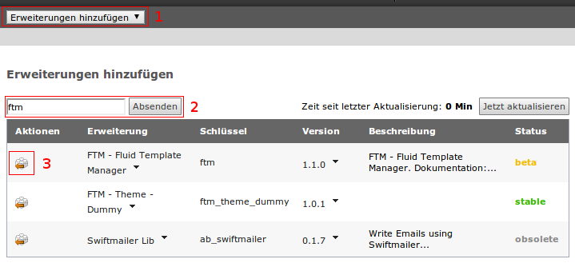
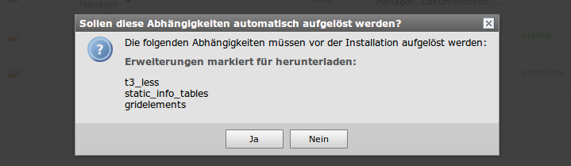
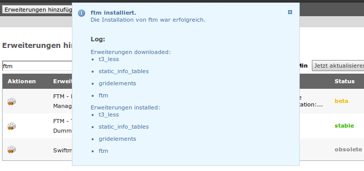
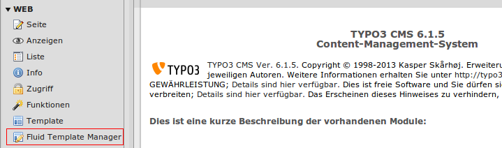
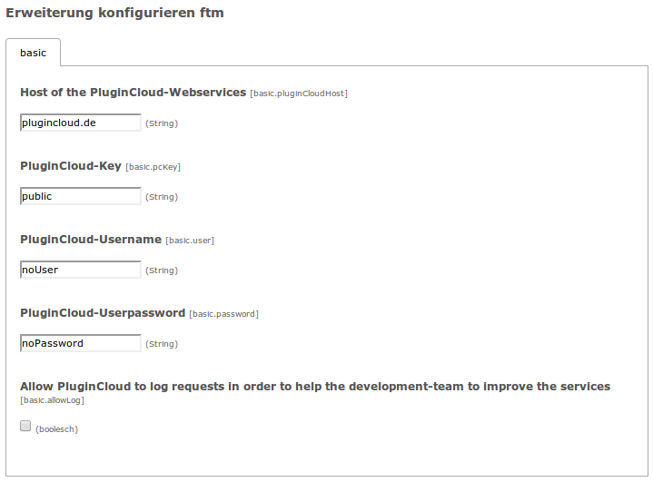

====================================================================
Installation & Konfiguration
====================================================================
`Fluid-Template-Manager.de <http://www.fluid-template-manager.de>`_ / `Dokumentation <http://www.fluid-template-manager.de/documentation>`_ / `Installation & Konfiguration <http://fluid-template-manager.de/documentation/Installation.html>`_

Hier finden Sie alle Informationen zur Installation und Konfiguration des FTM. 

Herunterladen können Sie den Fluid-Template-Manager im TER oder über die TYPO3-Seite:

`http://typo3.org/extensions/repository/view/ftm <http://typo3.org/extensions/repository/view/ftm>`_

Installation
====================================================================

.. note:: Ausgangs-Punkt ist eine frische TYPO3-Version 6.1.5 - Es wurden noch keine Extensions o.ä. installiert.

**1.** Melden Sie sich im TYPO3-Backend an und wechseln Sie in den Extension-Manager.

**1.1** Wechseln Sie im Header-Bereich zu *Erweiterungen hinzufügen*.

**1.2** Suchen Sie nach der Extension *ftm*.

**1.3** Klicken Sie auf *Extension installieren*.
    
**2.** Der Extension-Manager prüft nun im Hintergrund, ob und welche Extensions für den FTM erforderlich sind und fragt Sie (falls Sie diese noch nicht installiert haben) ob Sie diese auch installieren möchten.

Da wir in diesem Artikel den FTM 1.1.0 installieren, sind dies t3_less, static_info_tables, gridelements.

Bestätigen Sie dies mit **Ja**.

Nachdem der Extension-Manager nun den FTM installiert hat (und im Hintergrund alle erforderlichen Aktionen durchgeführt hat), erhalten Sie wenn alles geklappt hat die folgende Meldung:

**3.** Um nun sicherzugehen das auch alle neuinstallierten Module fehlerfrei verwendet werden können, leeren wir zur Sicherheit noch einmal alle Caches über das 'Blitz'-Menü oben rechts und laden anschließen noch einmal das komplette Browser-Fenster mit **F5** neu.

Nun sollten Sie im linken Menü-Abschnitt *WEB* einen Menüpunkt *Fluid-Template-Manager* finden.

.. important:: **Achtung:** Kopieren oder überschreiben Sie nie eine Extension einfach nur im ``typo3conf/ext`` Verzeichnis - verwenden Sie **immer** den Extension-Manager, damit TYPO3 entsprechende Extension-Abhängigkeiten prüfen und System-Aktualisierungen (z.B. Datenbank) durchführen kann! Andernfalls kann es zu unerwarteten Fehlern kommen.

Nun sollten Sie den FTM erfolgreich in Ihrem System integriert haben und können mit der notwendigen TYPO3-Konfiguration fortfahren.

TYPO3-Konfiguration
====================================================================
Damit der FTM alle Funktionen voll nutzen kann, müssen Sie einige Einstellungen an der TYPO3-Konfiguration vornehmen.

Vererbbare Felder
--------------------------------------------------------------------
.. include:: ./Snippets/LocalConfigurationAddRootLineFields.rst

Erlaubte Dateitypen
--------------------------------------------------------------------
.. include:: ./Snippets/LocalConfigurationAllowedFiles.rst

Konfiguration der Extension
====================================================================
Über den Extension-Manager kann der FTM, wie auch jede andere Extension, konfiguriert werden.

.. include:: ./Snippets/TypoScriptWebServiceMessage.rst

In diesem Bereich finden Sie die folgenden Einstellungen:

================================================================================================================= =================== ====================================================================================================================================================================================
Einstellung                                                                                                       Standardwert        Beschreibung                                            
================================================================================================================= =================== ====================================================================================================================================================================================
Host of the PluginCloud-Webservices [basic.pluginCloudHost]                                                       ``plugincloud.de``  Hier wird die URL des PluginCloud-WebServices angegeben

PluginCloud-Key [basic.pcKey]                                                                                     ``public``          Hier wird der PluginCloud-Key (auch Schlüssel genannt) angegeben.
                                                                                                                                      Standardmäßig wird ein offener Zugang (public) verwendet.
                                                                                                                                      Dies bedeutet aber nicht das das System offen oder ungeschützt ist, sondern lediglich das keine zusätzlichen Funktionen durch einen personalisierten Schlüssel zugeschaltet werden. 
PluginCloud-Username [basic.user]                                                                                 ``noUser``          Hier wird im Falle eines nicht public-Keys der Username eingetragen.
PluginCloud-Userpassword [basic.password]                                                                         ``noPassword``      Hier wird im Falle eines nicht public-Keys das Password eingetragen.
Allow PluginCloud to log requests in order to help the development-team to improve the services [basic.allowLog]  ``false``           Ist der Haken gesetzt, erlauben Sie der PluginCloud Ihre Anfragen in einem Log zu speichern.
                                                                                                                                      Wenn Sie dem FTM-Entwicklungsteam bei der Optimierung und Wartung der WebServices helfen wollen, aktivieren Sie gerne diesen Haken.
                                                                                                                                      Die geloggten Daten werden dann ausschließlich für Optimierung und Wartung verwendet!.
================================================================================================================= =================== ====================================================================================================================================================================================

Zusätzliche Sicherheits-Hinweise
====================================================================

.. important:: **Achtung:** Verwenden Sie keinen Backend-User mit dem Namen *admin*! Deaktivieren Sie diesen aus Sicherheitsgründen.

.. include:: ./Snippets/PoweredBy.rst