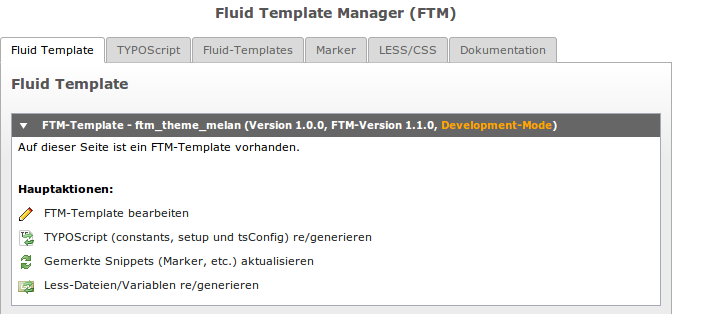

================================
FTM-Übersicht
================================
`Fluid-Template-Manager.de <http://www.fluid-template-manager.de>`_ / `Dokumentation <http://www.fluid-template-manager.de/documentation>`_ / `FTM-Übersicht <http://fluid-template-manager.de/documentation/FtmOverview.html>`_

Hier finden Sie alle Informationen über die FTM-Übersicht. 

--------------------------------------------------------------------
FTM-Template und Funktionen
--------------------------------------------------------------------
FTM bietet auf der Übersichtsseite eine Übersicht des Templates und stellt hier die Hauptfunktionen zum bearbeiten des Templates bereit.

========================================================= =============================================================
Funktion                                                  Beschreibung
========================================================= =============================================================
FTM-Template bearbeiten
TYPOScript (constants, setup und tsConfig) re/generieren  .. include:: ./Snippets/TypoScriptWebServiceMessage.rst
Gemerkte Snippets (Marker, etc.) aktualisieren
Less-Dateien/Variablen re/generieren
========================================================= =============================================================

.. include:: ./Snippets/PoweredBy.rst

