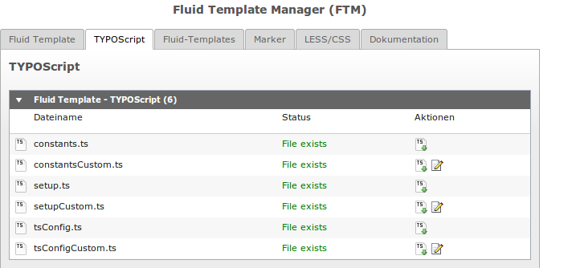

====================================================================
TypoScript
====================================================================
`Fluid-Template-Manager.de <http://www.fluid-template-manager.de>`_ / `Dokumentation <http://www.fluid-template-manager.de/documentation>`_ / `TypoScript <http://fluid-template-manager.de/documentation/TypoScript.html>`_

Hier findest Du alle Informationen über das TYPOScript im FTM.

--------------------------------------------------------------------
TYPOScript-Generator
--------------------------------------------------------------------

.. include:: ./Snippets/TypoScriptWebServiceMessage.rst

.. TODO:
    @todo: welche Daten werden an ihn geschickt -> möglichkeit in FTM bieten, das die gesendeten Daten angesehen werden können.
    @todo: werden daten in der cloud gespeichert? -> kann man helfen, in dem man log einschaltet

Sie haben einen Optimierungs-Vorschlag oder haben einen Fehler im generierten TYPOScript gefunden, dann schreiben Sie uns an: info@fluid-template-manager.de

Sie verwenden für gewöhnlich andere TYPOScript-Strukturen in Ihrer Agentur und möchten gerne das der TYPOScript-Generator auf Sie zugeschnittenes TYPOScript generiert?
Sprechen Sie uns an und wir richten Ihren eigenen personalisierten TYPOScript-Generator für Sie ein.

--------------------------------------------------------------------
Root-Template
--------------------------------------------------------------------
Das TypoScript Root-Template eines FTM-Templates wird automatisch erstellt, falls keins auf der Seite des Templates gefunden werden kann.
Das generierte Root-Template trägt den Namen *FTM Root-Template*.

.. important:: In den Root-Template sollten Sie keine eigenen Einstellungen vornehmen, außer ggf. ein zusätzliches include-static hinzuzufügen!

--------------------------------------------------------------------
TYPOScript Übersicht
--------------------------------------------------------------------

--------------------------------------------------------------------
Constants
--------------------------------------------------------------------
Beim Erstellen eines neuen FTM-Templates werden automatisch die Dateien constants.ts und constantsCustom.ts erstellt und in das Root-Template eingetragen.

* **constants.ts:** Hier werden vom FTM generierte Konstanten abgelegt.
* **constantsCustom.ts:** Hier können Sie eigene Konstanten definieren, ohne das diese vom FTM überschrieben werden. 

Die generierte *constants.ts* beinhaltet aktuell die folgenden Konstanten:

.. code-block:: ts
    
    # FTM-Template Directory
    ftmTemplateDir = ftm_theme_website
    
    # FTM-Template URL
    ftmTemplateUrl = typo3conf/ext/ftm_theme_website/
    

--------------------------------------------------------------------
Setup
--------------------------------------------------------------------
Beim Erstellen eines neuen FTM-Templates werden automatisch die Dateien setup.ts und setupCustom.ts erstellt und in das Root-Template eingetragen.

* **setup.ts:** Hier wird vom FTM generiertes TypoScript abgelegt.
* **setupCustom.ts:** Hier können Sie eigenes TypoScript definieren, ohne das diese vom FTM überschrieben werden. 
    

--------------------------------------------------------------------
Page-TYPOScript
--------------------------------------------------------------------

.. TODO:
    @todo: Das Page-TS muss noch beschrieben werden.

.. include:: ./Snippets/PoweredBy.rst